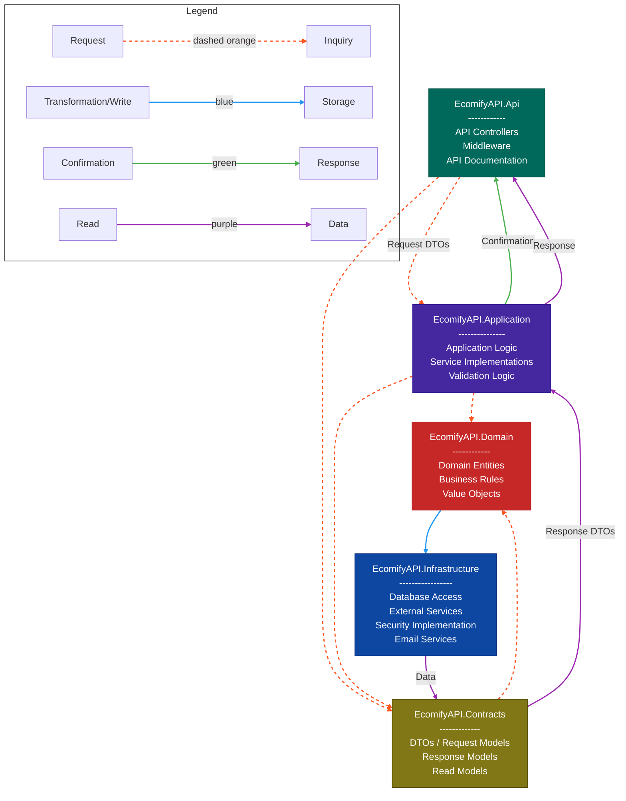

## Project Overview

Ecomify API is a conceptual e-commerce solution developed as a personal project to explore modern software architecture and .NET development practices. While not intended for production use, it showcases key features of scalable, secure, and maintainable web applications.

## Technology Stack

- **Framework**: .NET 8, ASP.NET Core
- **Architecture**: Clean Architecture with Domain-Driven Design (DDD)
- **Security**: Keycloak integration for authentication and role-based authorization using JWT tokens.
- **Data Access**: Dapper
- **Documentation**: Swagger/OpenAPI
- **Testing**: Unit and Integration Tests

## Architecture Overview



## Key Features

- **User Management**: Registration, authentication, and authorization
- **Product Catalog**: Product management with categories and search functionality
- **Shopping Cart**: Cart management with item addition, removal, and checkout
- **Order Processing**: Order creation, payment processing, and shipping options
- **Discount System**: Flexible discount and promotion engine
- **Payment Integration**: Simulated secure payment processing system for demonstration purposes.

## Domain Model

The application is centered around these core entities:

- **User**: Customer accounts with authentication and profile management
- **Product**: Items available for purchase with detailed information
- **Cart**: Shopping cart for collecting items before checkout
- **Order**: Purchase records with status tracking and history
- **Payment**: Transaction records and payment processing
- **Discount**: Special offers and promotional pricing

## Code Quality and Best Practices

- Clean Architecture separation of concerns
- SOLID principles implementation
- Comprehensive error handling
- Automated testing with high coverage

## Development Process

The application follows modern development methodologies including:

- Continuous Integration/Continuous Deployment pipelines
- Code reviews and quality gates
- Test-driven development
- Documentation as code

## Getting Started

### Prerequisites

- .NET 8 SDK
- Docker and Docker Compose (recommended)
- PostgreSQL 13+ (if not using Docker)
- Keycloak (if not using Docker)

### Docker Setup (Recommended)

The easiest way to get started is using Docker Compose, which will set up PostgreSQL and Keycloak for you.

1. Ensure Docker and Docker Compose are installed on your system

2. Start the containers:

````

docker-compose up -d

```

3. The following services will be available:

- PostgreSQL: localhost:5432 (DB: EcomifyAPI, User: keycloak_user)
- Keycloak: http://localhost:8080 (Admin user: admin_user, Admin password: Adm1n_K3ycl0ak_2025!)

4. Apply database migrations:

```

# Using Docker's psql

docker exec -i postgres psql -U keycloak_user -d EcomifyAPI < migration.sql

````

5. Update connection strings in `src/EcomifyAPI.Api/appsettings.json` to use the Docker setup:

```json
{
  "ConnectionStrings": {
    "DefaultConnection": "Host=localhost;Database=EcomifyAPI;Username=keycloak_user;Password=K3ycl0ak_P0stgr3s_2025!"
  }
  // Other settings...
}
```

### Keycloak Configuration

When running `docker-compose up -d`, Keycloak is automatically configured with the `base-realm` realm and all necessary roles and groups pre-configured from the `realm-export.json` file. However, you need to get the correct client secret for your application:

1. Access the Keycloak Admin Console:
   - URL: http://localhost:8080/admin
   - Username: admin_user
   - Password: Adm1n_K3ycl0ak_2025!
2. Select the "base-realm" realm from the dropdown in the top-left corner

3. Go to "Clients" in the left sidebar and click on the "base-realm" client

4. Navigate to the "Credentials" tab to view the client secret

5. Copy the displayed client secret and update your `appsettings.json` with this value in multiple places:
   ```json
   "UserKeycloakAdmin": {
     // other settings...
     "client_secret": "YOUR_NEW_CLIENT_SECRET",
     // other settings...
   },
   "UserKeycloakClient": {
     // other settings...
     "client_secret": "YOUR_NEW_CLIENT_SECRET",
     // other settings...
   },
   "Keycloak": {
     // other settings...
     "Credentials": {
       "Secret": "YOUR_NEW_CLIENT_SECRET"
     },
     // other settings...
   }
   ```

This step is critical because the client secret is regenerated each time you start Keycloak, and the API will not authenticate properly without the correct secret.

### Manual Database Setup

If you prefer to set up your database manually:

1. Create a new PostgreSQL database for the application:

   ```
   CREATE DATABASE ecomify;
   ```

2. Run the migration script to create all required tables:

   ```
   psql -U postgres -d ecomify -f migration.sql
   ```

### Application Setup

1. Clone the repository

   ```
   git clone https://github.com/yourusername/EcomifyAPI.git
   cd EcomifyAPI
   ```

2. Update connection strings in `src/EcomifyAPI.Api/appsettings.json`:

   ```json
   {
     "ConnectionStrings": {
       "DefaultConnection": "Host=localhost;Database=ecomify;Username=postgres;Password=your_password"
     }
     // Other settings...
   }
   ```

3. Build and run the application:

   ```
   dotnet build
   cd src/EcomifyAPI.Api
   dotnet run
   ```

4. Access the Swagger documentation at:
   ```
   https://localhost:5001/swagger
   ```

## Testing

Run the unit tests:

```
dotnet test test/EcomifyAPI.UnitTests
```

Run the integration tests:

```
dotnet test test/EcomifyAPI.IntegrationTests
```
